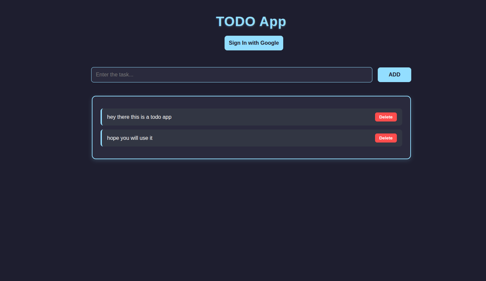

# 🧠 Minimal TODO

A **clean**, **minimal**, and **powerful** TODO app — no distractions, no nonsense, just tasks.

## 🚀 Features

* ✅ Add, delete, and track your tasks with zero fluff.
* 🔐 Google login for personalized task saving (or skip it and use it offline).
* ☁️ Syncs tasks to Firestore when logged in.
* 🤀 Tasks clear on logout (because privacy matters).
* ✨ Fast, lightweight, and responsive — works great on both mobile and desktop.

### 🖼️ Live Site

🔗 [minimal-todo-sooty.vercel.app](https://minimal-todo-sooty.vercel.app/)


## 🧹 Tech Stack

* React + Vite
* Firebase Auth (Google)
* Firestore (for saving tasks)

## 📸 Preview

 <!-- Add a screenshot in your repo and change the filename if needed -->

## 🛠️ Run Locally

Clone the project and install dependencies:

```bash
git clone https://github.com/OnlineBunker/minimal-todo.git
cd minimal-todo
npm install
npm run dev
```

> Make sure your Firebase config is set correctly in `/src/firebase.js`.

## 🤝 Contributing

Not really open to PRs right now unless you're fixing a bug. This app thrives on staying minimal and focused.

## 📄 License

MIT — do whatever you want, just don’t add a bunch of junk to it.

---

### Why another TODO app?

Because most TODO apps try to be everything.
This one just tries to get out of your way.

---

Built with ☕ and 🧠 by [@OnlineBunker](https://github.com/OnlineBunker)
